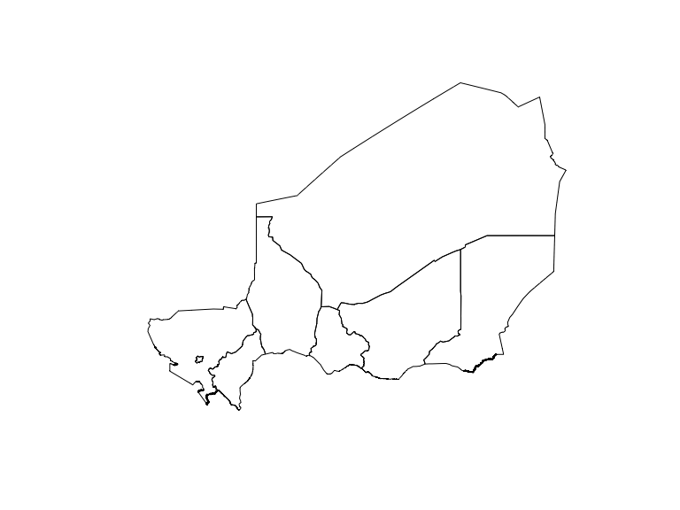

<!-- README.md is generated from README.Rmd. Please edit that file -->

# fieldmaps

<!-- badges: start -->

<!-- badges: end -->

`{fieldmaps}` provides an R interface to
[fieldmaps](https://fieldmaps.io), a humanitarian geospatial data
platform that delivers standardized, edge-matched administrative
boundaries for countries worldwide. The package enables easy access to
high-quality reference data designed for humanitarian and development
work, especially in challenging environments with limited connectivity
or variable data quality.

## About Fieldmaps

Fieldmaps consolidates authoritative geospatial data from multiple
sources into a living, practical database:

- **Data sources**: OpenStreetMap baseline enhanced with UN OCHA Common
  Operational Datasets (COD), national authoritative sources, and
  geoBoundaries
- **Edge-matched boundaries**: Globally consistent administrative
  boundaries that eliminate gaps and overlaps
- **Two datasets**:
  - `humanitarian`: UN OCHA COD data prioritizing validated humanitarian
    datasets
  - `open`: geoBoundaries data providing comprehensive global coverage
- **Multiple geometry types**: Polygons, lines, and points for flexible
  mapping needs

The platform specifically targets humanitarian field workers operating
under resource constraints, making geographic data accessible even in
low-bandwidth environments.

## Installation

You can install the development version of like so:

``` r
pak::pak("epicentre-msf/")
```

## Features

- **Simple API**: Two main functions for downloading administrative
  boundaries
- **Flexible country input**: Accepts country names or ISO3 codes (e.g.,
  “Kenya” or “KEN”)
- **Multiple admin levels**: Access levels 1-4 depending on data
  availability
- **Dataset choice**: Select between humanitarian (COD) or open
  (geoBoundaries) datasets
- **Geometry options**: Download polygons, lines, or points
- **Efficient data access**: Leverages DuckDB to query remote Parquet
  files without full downloads
- **Automatic validation**: Built-in country code conversion and level
  checking
- **SF integration**: Returns standard `sf` objects ready for spatial
  analysis

## Example

### Download a single administrative level

``` r
library(fieldmaps)

# Download admin level 1 boundaries
adm1 <- get_adm_level("Niger", level = 1)

# features provided by 
dplyr::glimpse(adm1)
#> Rows: 8
#> Columns: 39
#> $ fid        <int> 2098, 2099, 2100, 2101, 2102, 2103, 2104, 2105
#> $ adm1_id    <chr> "NER-20240408-1", "NER-20240408-2", "NER-20240408-3", "NER-20240408-4", "NER-20240408-5", "NER-20240408…
#> $ adm1_src   <chr> "NE001", "NE002", "NE003", "NE004", "NE005", "NE006", "NE007", "NE008"
#> $ adm1_name  <chr> "Agadez", "Diffa", "Dosso", "Maradi", "Tahoua", "Tillabéri", "Zinder", "Niamey"
#> $ adm1_name1 <chr> NA, NA, NA, NA, NA, NA, NA, NA
#> $ adm1_name2 <chr> NA, NA, NA, NA, NA, NA, NA, NA
#> $ adm0_id    <chr> "NER-20250729", "NER-20250729", "NER-20250729", "NER-20250729", "NER-20250729", "NER-20250729", "NER-20…
#> $ adm0_src   <chr> "NER", "NER", "NER", "NER", "NER", "NER", "NER", "NER"
#> $ adm0_name  <chr> "Niger", "Niger", "Niger", "Niger", "Niger", "Niger", "Niger", "Niger"
#> $ adm0_name1 <chr> "Niger", "Niger", "Niger", "Niger", "Niger", "Niger", "Niger", "Niger"
#> $ adm0_name2 <dbl> NA, NA, NA, NA, NA, NA, NA, NA
#> $ src_lvl    <int> 3, 3, 3, 3, 3, 3, 3, 3
#> $ src_lang   <chr> "fr", "fr", "fr", "fr", "fr", "fr", "fr", "fr"
#> $ src_lang1  <chr> NA, NA, NA, NA, NA, NA, NA, NA
#> $ src_lang2  <chr> NA, NA, NA, NA, NA, NA, NA, NA
#> $ src_date   <date> 2006-01-01, 2006-01-01, 2006-01-01, 2006-01-01, 2006-01-01, 2006-01-01, 2006-01-01, 2006-01-01
#> $ src_update <date> 2024-04-08, 2024-04-08, 2024-04-08, 2024-04-08, 2024-04-08, 2024-04-08, 2024-04-08, 2024-04-08
#> $ src_name   <chr> " IGNN (as of 2006) and  OCHA/ROWCA ( 2014/ 2015)", " IGNN (as of 2006) and  OCHA/ROWCA ( 2014/ 2015)",…
#> $ src_name1  <chr> "OCHA Niger", "OCHA Niger", "OCHA Niger", "OCHA Niger", "OCHA Niger", "OCHA Niger", "OCHA Niger", "OCHA…
#> $ src_lic    <chr> "Other", "Other", "Other", "Other", "Other", "Other", "Other", "Other"
#> $ src_url    <chr> "https://data.humdata.org/dataset/cod-ab-ner", "https://data.humdata.org/dataset/cod-ab-ner", "https://…
#> $ src_grp    <chr> "COD", "COD", "COD", "COD", "COD", "COD", "COD", "COD"
#> $ iso_cd     <int> 562, 562, 562, 562, 562, 562, 562, 562
#> $ iso_2      <chr> "NE", "NE", "NE", "NE", "NE", "NE", "NE", "NE"
#> $ iso_3      <chr> "NER", "NER", "NER", "NER", "NER", "NER", "NER", "NER"
#> $ iso_3_grp  <chr> "NER", "NER", "NER", "NER", "NER", "NER", "NER", "NER"
#> $ region3_cd <int> 11, 11, 11, 11, 11, 11, 11, 11
#> $ region3_nm <chr> "Western Africa", "Western Africa", "Western Africa", "Western Africa", "Western Africa", "Western Afri…
#> $ region2_cd <int> 202, 202, 202, 202, 202, 202, 202, 202
#> $ region2_nm <chr> "Sub-Saharan Africa", "Sub-Saharan Africa", "Sub-Saharan Africa", "Sub-Saharan Africa", "Sub-Saharan Af…
#> $ region1_cd <int> 2, 2, 2, 2, 2, 2, 2, 2
#> $ region1_nm <chr> "Africa", "Africa", "Africa", "Africa", "Africa", "Africa", "Africa", "Africa"
#> $ status_cd  <int> 1, 1, 1, 1, 1, 1, 1, 1
#> $ status_nm  <chr> "State", "State", "State", "State", "State", "State", "State", "State"
#> $ wld_date   <date> 2025-02-24, 2025-02-24, 2025-02-24, 2025-02-24, 2025-02-24, 2025-02-24, 2025-02-24, 2025-02-24
#> $ wld_update <date> 2025-07-29, 2025-07-29, 2025-07-29, 2025-07-29, 2025-07-29, 2025-07-29, 2025-07-29, 2025-07-29
#> $ wld_view   <chr> "intl", "intl", "intl", "intl", "intl", "intl", "intl", "intl"
#> $ wld_notes  <chr> NA, NA, NA, NA, NA, NA, NA, NA
#> $ geometry   <MULTIPOLYGON [°]> MULTIPOLYGON (((7.000488 15..., MULTIPOLYGON (((12.68944 13..., MULTIPOLYGON (((3.680954 11..., MULTIPO…

# plot the boundaries
plot(adm1$geometry)
```



### Download all available administrative levels

``` r
# Download all available admin levels for a country
shps <- get_all_adm_levels("NER") # use country name or ISO3 code

# Access individual levels
shps$ADM1  # Level 1 boundaries
shps$ADM2  # Level 2 boundaries
shps$ADM3  # Level 3 boundaries
```

### Use different datasets and geometry types

``` r
# Get boundaries from the open dataset (geoBoundaries)
adm1_open <- get_adm_level("Uganda", level = 1, dataset = "open")

# Get line geometry instead of polygons
adm1_lines <- get_adm_level("Somalia", level = 1, geom = "lines")

# Get point geometry (administrative centers)
adm1_points <- get_adm_level("Ethiopia", level = 1, geom = "points")
```

## Technical Details

\*\*\*\* uses [DuckDB](https://duckdb.org/) to efficiently query remote
Parquet files hosted by without downloading entire datasets. Data is
then converted into R `sf` objects efficiently via geoarrow.

This approach minimizes bandwidth requirements and provides fast access
to boundaries, making it suitable for use in low-connectivity
environments.

## Data Attribution

All data accessed through this package comes from
[Fieldmaps](https://.io) and includes:

- **Humanitarian dataset**: UN OCHA Common Operational Datasets (COD)
- **Open dataset**: geoBoundaries data
- Underlying data from OpenStreetMap, national mapping agencies, and
  other authoritative sources

Please refer to the `src_name`, `src_url`, and `src_lic` fields in the
returned data for specific attribution and licensing information for
each country.

## Related Packages

- [rgeoboundaries](https://github.com/dickoa/rgeoboundaries) - Access
  geoBoundaries data directly
- [rnaturalearth](https://github.com/ropensci/rnaturalearth) - Natural
  Earth map data
- [osmdata](https://github.com/ropensci/osmdata) - OpenStreetMap data
  access
